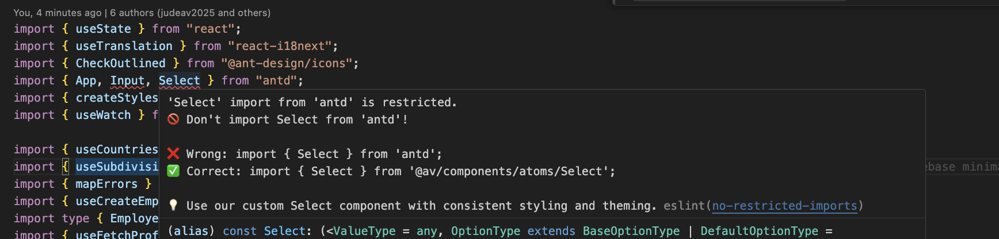

When building a frontend for an enterprise product, you face a classic tradeoff: build your own component library from scratch (slow, expensive) or adopt an existing one like Ant Design (fast, but you lose control). After mentoring 10+ developers and scaling a frontend team, I've landed on a pattern that gives you the best of both worlds.

## The Core Pattern

The idea is simple: import the component library directly in feature code if no customizations are needed. If you need customizations, create a thin wrapper layer around the Ant Design components. You can structure your wrapper components however you like. I used a progressively growing pattern of atomic design, starting with atoms, then molecules, and finally organisms.

```
@av/components/
├── atoms/
│   ├── Alert/
│   ├── Button/
│   ├── Card/
│   ├── Input/
│   ├── Modal/
│   └── Select/
├── molecules/
│   ├── DatePicker/
│   ├── Dropdown/
│   └── Descriptions/
└── organisms/
    └── ...
```

As components are customized, they're wrapped around the Ant Design component. To keep things simple and move fast, it's best to conform to the component library as much as possible. This way you don't sacrifice the free goodies that come with using a component library.

## Why Wrap Components?

Because we want to override or customize the component's behavior or appearance without sacrificing the rich features of the component library. The prop interface your component exposes will be mostly similar to the original Ant Design component, but you'll add to it based on the customizations requested by your designer.

This highlights an important aspect of this workflow: you need strong collaboration with your designer to ensure customizations align with the overall library. If they don't, introduce a new component instead.

## Example: A Wrapped TextArea Component

Here's a real wrapped component using `antd-style` for theming:

```tsx
// @av/components/atoms/input/TextArea.tsx
import TextArea, {
    type TextAreaProps as AntdTextAreaProps,
} from "antd/lib/input/TextArea";
import { createStyles } from "antd-style";

import type { AvE2EProps } from "@av/components/types";

type TextAreaProps = AntdTextAreaProps & AvE2EProps;

const useStyles = createStyles(({ css, token }) => ({
    textArea: css`
        &:hover {
            border-color: ${token.colorLinkHover};
        }
        &:active {
            border-color: ${token.colorLinkActive};
        }
    `,
}));

export function CustomTextArea(props: TextAreaProps) {
    const { testIdPrefix, ...rest } = props;
    const { styles } = useStyles();

    return (
        <TextArea
            className={styles.textArea}
            data-testid={testIdPrefix + "-text-area-input"}
            {...rest}
        />
    );
}
```

This pattern gives you:

- **Custom styling** using Ant Design's theme tokens (`token.colorLinkHover`)
- **E2E testing support** via a consistent `testIdPrefix` prop convention
- **Type safety** by extending the original Ant Design props

For components that don't need customization yet, just re-export:

```tsx
// @av/components/atoms/Alert/index.tsx
export { Alert, type AlertProps } from "antd";
```

This lets you add customizations later without changing any imports in feature code.

## Enforcing the Pattern with ESLint

The pattern only works if you enforce it. And you have a dilemma. You need developers to be able to import from ant design whenever there is no custom component available. But if we have an override in our component library, we need to block direct Ant Design imports. Because if a component is overridden and devs import the component directly from ant design, it will lead to inconsistencies and they will not get the custom styling and theming.

To achieve this we used the good old linter of ESLint's `no-restricted-imports` rule to block direct Ant Design imports. And we wanted to have a setup that is easy to extend as we continue to add more components to our library.

Following is an of how we did that.

```js
// eslint-restricted-imports.js
export const CUSTOM_COMPONENTS = {
    Alert: { from: "antd", to: "@av/components/atoms/Alert" },
    Button: { from: "antd", to: "@av/components/atoms/Button" },
    Card: { from: "antd", to: "@av/components/atoms/Card" },
    Form: { from: "antd", to: "@av/components/atoms/Form" },
    Input: { from: "antd", to: "@av/components/atoms/input/Input" },
    Modal: { from: "antd", to: "@av/components/atoms/Modal" },
    Select: { from: "antd", to: "@av/components/atoms/Select" },
    DatePicker: { from: "antd", to: "@av/components/molecules/DatePicker" },
    Dropdown: { from: "antd", to: "@av/components/molecules/Dropdown" },
    // ... add more as needed
};

const ruleTemplate = {
    customComponent: (importName, fromLibrary, customPath) => ({
        name: fromLibrary,
        importNames: [importName],
        message: `
🚫 Don't import ${importName} from '${fromLibrary}'!

❌ Wrong: import { ${importName} } from '${fromLibrary}';
✅ Correct: import { ${importName} } from '${customPath}';

💡 Use our custom ${importName} component with consistent styling and theming.`,
    }),
};

export function getRestrictedImportRules() {
    return Object.entries(CUSTOM_COMPONENTS).map(([componentName, config]) =>
        ruleTemplate.customComponent(componentName, config.from, config.to)
    );
}
```

Then in your ESLint config:

```js
// eslint.config.js
import { getRestrictedImportRules } from "./eslint-restricted-imports.js";

export default [
    {
        rules: {
            "no-restricted-imports": [
                "error",
                {
                    paths: getRestrictedImportRules(),
                },
            ],
        },
    },
];
```

When someone tries to import directly from Ant Design, they get a clear error with the correct path:



## Why This Worked for Us

- **Team moved fast** — Developers used familiar Ant Design patterns without learning a new API. Overrides only when needed.
- **Consistent styling** — Theme changes propagate automatically via Ant Design's token system.
- **Solid foundation** — Piggyback on an existing component library, overriding only when required.

The key insight is that you don't need to reinvent the wheel. You just need a thin abstraction layer and the discipline to enforce it. ESLint handles the enforcement for you.

## A Key Caveat

One difficulty we faced: as time went on, some components needed to be wrapped that weren't originally. This requires a refactoring effort to move the component to the library.

If your team isn't disciplined and customizes components in various places, it becomes a nightmare to consolidate them. One solution is to mandatorily wrap _all_ components from day one. This eliminates the refactoring problem but doesn't prevent customizations done outside the library—that still requires code reviews.

The tradeoff is speed vs. consistency. Wrapping everything upfront is slower initially but saves pain later. Choose based on your team's discipline and product timeline.

## Final Thoughts

This pattern has served us well across multiple enterprise products. The combination of atomic design, thin wrappers, and ESLint enforcement creates a system that scales with your team while keeping velocity high.

Start small: wrap only what you need to customize, re-export everything else, and let ESLint guard the gates.
